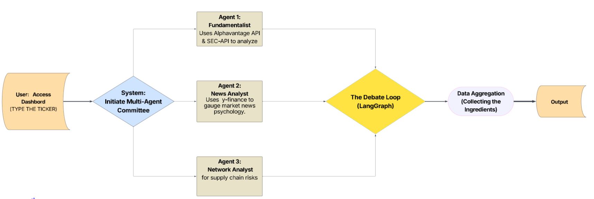

# DIALECTIC

**Dialectic** is an advanced AI-powered market analysis system that employs a multi-agent architecture to perform deep-dive financial research. It simulates a debate between "Buy" (Bull) and "Sell" (Bear) agents based on gathered data, culminating in a final verdict by a Judge agent.

## Description

Dialectic automates the complex process of stock market research by coordinating specialized autonomous agents. Instead of receiving a simple summary, users can watch a simulated debate where agents argue for and against an investment based on real-time data from financial statements, news, and network analysis.

The system integrates **Fundamental Analysis**, **News Sentiment Analysis**, and **Network/Risk Analysis** to provide a holistic view of a stock ticker. All findings are synthesized into a final report and verdict, accessible via an interactive Streamlit dashboard.

## Features

*   **Multi-Agent Data Gathering**:
    *   **Fundamental Analyst**: Retrieves and analyzes balance sheets, income statements, and key financial metrics using AlphaVantage.
    *   **News Analyst**: Aggregates recent news, analyzes sentiment, and identifies market trends using yfinance and web scraping.
    *   **Network Analyst**: Investigates supply chain risks, competitor landscape, and 10-K filings using the SEC API.
*   **Simulated Debate Loop**: Orchestrates a debate between Bull and Bear agents using `LangGraph`, ensuring a balanced evaluation of the gathered evidence.
*   **Verdict Generation**: A sophisticated "Judge" agent reviews the debate arguments to issue a final "Buy" or "Sell" recommendation with a confidence score.
*   **Interactive Dashboard**: A user-friendly web interface linked to the agent backend for easy visualization of reports and debate progress.

## Tech Stack

*   **Language**: Python 3.8+
*   **Frontend**: Streamlit
*   **Orchestration**: LangGraph, LangChain
*   **LLMs**: OpenRouter (NVIDIA Nemotron, etc.), OpenAI
*   **Database**: ChromaDB (Vector Search & Storage)
*   **APIs & Data Sources**:
    *   AlphaVantage (Financial Data)
    *   yfinance (Market News)
    *   SEC API (10-K Filings)
    *   BeautifulSoup4 (Web Scraping)

## Installation

1.  **Clone the repository**
    ```bash
    git clone https://github.com/MDGSpace-SOC-D-2025/Dialectic.git
    ```

2.  **Create and activate a virtual environment**
    ```bash
    python -m venv venv
    source venv/bin/activate  # On Windows: venv\Scripts\activate
    ```

3.  **Install dependencies**
    ```bash
    pip install -r requirements.txt
    ```

## Usage

1.  **Run the Streamlit Application**
    ```bash
    streamlit run app.py
    ```

2.  **Using the Dashboard**
    *   Enter a valid stock ticker (e.g., `NVDA`, `AAPL`) in the sidebar.
    *   Click **Run Full Analysis** to trigger the agents.
    *   Explore the tabs to view individual reports (Financial, News, Network).
    *   Watch the **Debate Loop** unfold and wait for the **Final Verdict**.

## Configuration / Environment Variables

Create a `.env` file in the root directory of the project. You will need API keys for the various services used.

**Required `.env` format:**

```env
# LLM Provider Configuration
OPENROUTER_API_KEY=your_openrouter_api_key
OPENAI_API_BASE="https://openrouter.ai/api/v1"

# Data Provider Keys
ALPHA_VANTAGE_API_KEY=your_alphavantage_key
MY_API_KEY=your_sec_api_key  # API Key for sec-api
```

> **Note**: `MY_API_KEY` refers to the [sec-api](https://sec-api.io) key used for fetching 10-K filings.

## Screenshots


### Multi-Agent System Architecture Flowchart


## Project Structure

```text
├── app.py                  # Streamlit frontend entry point
├── main.py                 # CLI entry point and orchestration logic
├── requirements.txt        # Python dependency list
├── .env                    # Environment variables (not committed)
├── configuration/          # LLM and constant configurations
├── src/
│   └── agents/             # Agent logic (Fundamental, News, Network)
├── nodes/                  # LangGraph nodes (Debaters, Judge)
├── prompts/                # System prompts for LLMs
├── workflow/               # LangGraph workflow definitions
├── utils.py                # Helper functions
├── chroma_db_*/            # Persistent vector stores for contexts
└── *.md                    # Generated markdown reports
```

## Roadmap

### Phase 1: Core Agent Development
*   **Fundamental Analyst**: Integrated AlphaVantage API for retrieving balance sheets and income statements.
*   **News Analyst**: Implemented yfinance and web scraping to fetch and analyze market sentiment.
*   **Network Analyst**: Utilized SEC API to process 10-K filings and extract supply chain risks using RAG (ChromaDB).

### Phase 2: Orchestration & Logic
*   **Debate System**: Designed a Bull vs. Bear debate loop using `LangGraph` to simulate argumentative reasoning.
*   **Judge Agent**: Created a final verdict node to synthesize debate points and issue a Buy/Sell recommendation.
*   **Workflow Integration**: Connected all agents into a unified graph architecture.

### Phase 3: Interface & User Experience
*   **Streamlit Dashboard**: Built an interactive UI for real-time analysis triggering and report visualization.
*   **Report Generation**: Automated the creation of markdown reports for each analysis sector.

### Phase 4: Future Improvements
*   User Authentication & Save History
*   Support for Local LLMs (Ollama/LlamaCpp)
*   Enhanced Financial Charts (Plotly/Matplotlib integration)
*   Docker Containerization for simplified deployment

## Known Issues

*   **API Rate Limits**: Free tier keys for AlphaVantage or OpenRouter may hit rate limits during intensive debates.
*   **LLM Hallucinations**: While grounded in data, agents may occasionally halluncinate details; always verify critical financial data.
*   **SEC API Latency**: Fetching large 10-K filings can take time depending on network conditions.
